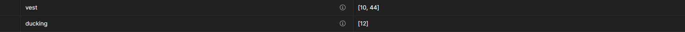

# RWW_ML_BACKEND
## Описание
Это API на Flask, для работы веб-приложения по автоматическому обнаружению нарушений правил безопасности на записях с нагрудных камер работников РЖД.
## Установка и запуск
### Linux
1. Клонирование репозитория:
```bash
git clone https://github.com/muz-muzzy/RWW_ML_BACKEND.git
```
2. Переход в каталог проекта:
```bash
cd RRWViolationDetection
```
3.  Создание виртуального окружения:
```bash
python3 -m venv venv
```
4. Вход в виртуальное окружение:
```bash
source ./venv/bin/activate
```
5. Установка зависимостей:
```bash
pip install -r requirements.txt
```
6. Скачивание весов модели:
```bash
python3 ./models/DuckingModel/download.py
```
7. Запуск
```bash
python app.py
```

## Роуты
### /getvideos
Метод - GET
Результат - JSON файл вида:
{
    "files": [
        "video1.mp4",
        "video2.mp4", 
        ....
    ]
}

### /getvideo/%filename%
Метод - GET
Результат - .mp4 файл (видео)
Отдаёт видео по его названию (передаётся в url, например - "http://127.0.0.1:3000/getvideo/video.mp4").
В headers ответа функции также содержатся списки таймкодов нарушений всех видов


### /upload
Метод - POST
Принимает form-data с .mp3 файлом, загружает его на сервер, анализируя его, и сохраняя данные о нём в БД.
Возвращает JSON с сообщением об успехе или неудаче
